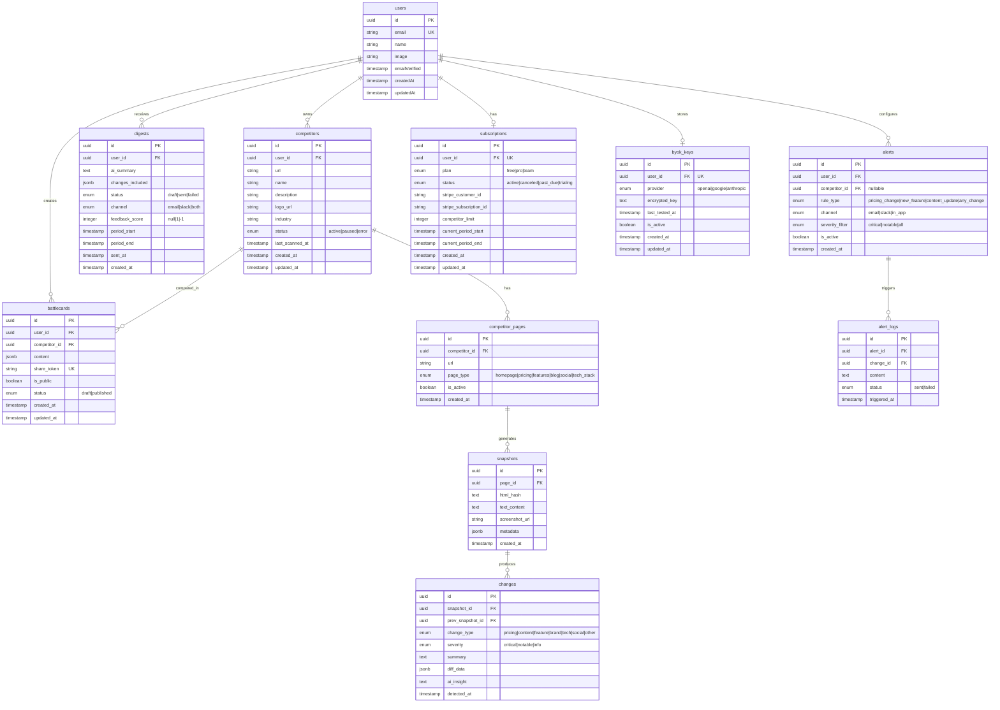
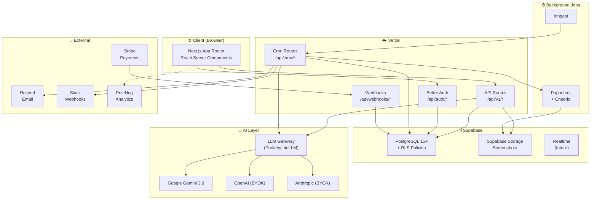
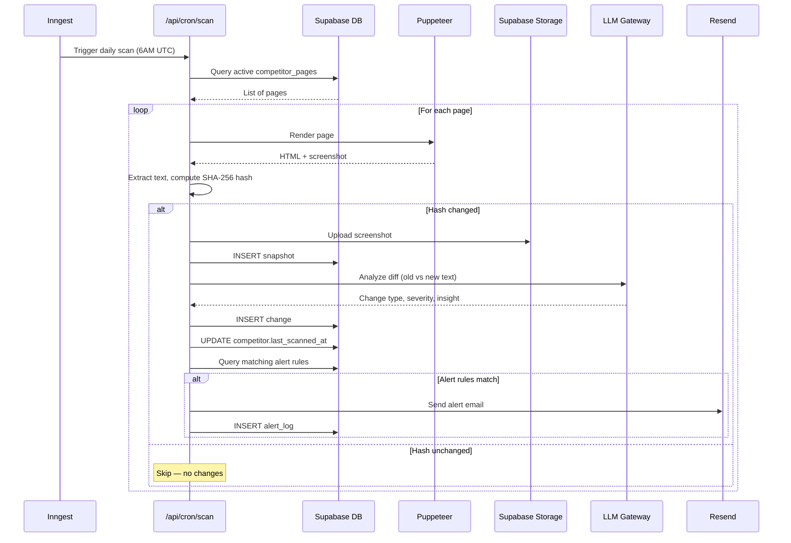

# CompeteRadar — Phase 4: Architecture & Database Design

**Phiên bản**: 1.2  
**Ngày**: 2026-03-11  
**Trạng thái**: 🟡 Bản nháp — Chờ duyệt  
**Skills sử dụng**: `api-design`, `supabase-postgres-best-practices`, `vercel-react-best-practices`, `vercel-composition-patterns`, `brainstorming`

---

## 4.1 Tech Stack — Xác Nhận

> Dựa trên PRD mục 8 (đã duyệt). Không thay đổi.

| Tầng | Công nghệ | Phiên bản | Lý do |
|------|-----------|-----------|-------|
| **Framework** | Next.js | 14 (App Router) | SSR, API routes, Vercel-native |
| **UI** | Tailwind CSS | 3.x | Utility-first, rapid prototyping |
| **Auth** | Better Auth | Latest | Self-hosted, TypeScript-native, OAuth + email |
| **Database** | Supabase (PostgreSQL) | Latest (PG 15+) | RLS, realtime, generous free tier |
| **Scraping** | Puppeteer + Cheerio | Latest | Full browser rendering + fast HTML parsing |
| **AI (Dev)** | Google Gemini 3.0 | Flash + Pro | Flash cho batch, Pro cho digest |
| **AI (Prod)** | LLM Gateway (Portkey/LiteLLM) | Latest | Multi-provider routing, fallback, cost tracking |
| **Email** | Resend | Latest | Developer-friendly transactional email |
| **Hosting** | Vercel | Latest | Edge functions, preview deployments |
| **Job Queue** | Inngest | Latest | Serverless-friendly, Vercel-native |
| **Analytics** | PostHog | Cloud | Product analytics, feature flags |
| **Payments** | Stripe | Latest | Subscriptions, webhooks, checkout |
| **Validation** | Zod | 3.x | Runtime type checking, schema inference |
| **ORM** | Drizzle ORM | Latest | Type-safe, lightweight, SQL-like syntax |

### Quyết định kiến trúc

- **App Router** (không Pages Router) — server components mặc định, streaming
- **Drizzle ORM** thay vì raw SQL — type safety, migration generation, nhưng vẫn SQL-like
- **Inngest** thay vì BullMQ — serverless-native, không cần Redis, tích hợp Vercel
- **Stripe** cho payments — industry standard, webhook-driven

---

## 4.2 Database Schema

### ERD — Entity Relationship Diagram



### SQL Migrations

```sql
-- ============================================================
-- CompeteRadar Database Schema v1.0
-- Supabase (PostgreSQL 15+)
-- ============================================================

-- Enable extensions
CREATE EXTENSION IF NOT EXISTS "uuid-ossp";
CREATE EXTENSION IF NOT EXISTS "pgcrypto";

-- ============================================================
-- ENUMS
-- ============================================================

CREATE TYPE competitor_status AS ENUM ('active', 'paused', 'error');
CREATE TYPE page_type AS ENUM ('homepage', 'pricing', 'features', 'blog', 'social', 'tech_stack');
CREATE TYPE change_type AS ENUM ('pricing', 'content', 'feature', 'brand', 'tech', 'social', 'other');
CREATE TYPE severity AS ENUM ('critical', 'notable', 'info');
CREATE TYPE digest_status AS ENUM ('draft', 'sent', 'failed');
CREATE TYPE digest_channel AS ENUM ('email', 'slack', 'both');
CREATE TYPE alert_rule_type AS ENUM ('pricing_change', 'new_feature', 'content_update', 'any_change');
CREATE TYPE alert_channel AS ENUM ('email', 'slack', 'in_app');
CREATE TYPE battlecard_status AS ENUM ('draft', 'published');
CREATE TYPE plan_type AS ENUM ('free', 'pro', 'team');
CREATE TYPE subscription_status AS ENUM ('active', 'canceled', 'past_due', 'trialing');
CREATE TYPE ai_provider AS ENUM ('openai', 'google', 'anthropic');
CREATE TYPE alert_log_status AS ENUM ('sent', 'failed');

-- ============================================================
-- TABLES
-- ============================================================

-- users: Managed by Better Auth (schema follows their convention)
-- Better Auth tự tạo bảng users, sessions, accounts, verifications
-- Chúng ta chỉ tham chiếu users.id trong các bảng khác

-- Competitors
CREATE TABLE competitors (
    id UUID PRIMARY KEY DEFAULT uuid_generate_v4(),
    user_id UUID NOT NULL REFERENCES auth.users(id) ON DELETE CASCADE,
    url TEXT NOT NULL,
    name VARCHAR(255) NOT NULL,
    description TEXT,
    logo_url TEXT,
    industry VARCHAR(100),
    status competitor_status NOT NULL DEFAULT 'active',
    last_scanned_at TIMESTAMPTZ,
    created_at TIMESTAMPTZ NOT NULL DEFAULT NOW(),
    updated_at TIMESTAMPTZ NOT NULL DEFAULT NOW(),
    
    UNIQUE(user_id, url)  -- 1 user không thêm trùng URL
);

-- Competitor Pages (các trang cần theo dõi của 1 đối thủ)
CREATE TABLE competitor_pages (
    id UUID PRIMARY KEY DEFAULT uuid_generate_v4(),
    competitor_id UUID NOT NULL REFERENCES competitors(id) ON DELETE CASCADE,
    url TEXT NOT NULL,
    page_type page_type NOT NULL,
    is_active BOOLEAN NOT NULL DEFAULT TRUE,
    created_at TIMESTAMPTZ NOT NULL DEFAULT NOW(),
    
    UNIQUE(competitor_id, url)
);

-- Snapshots (ảnh chụp nội dung tại thời điểm quét)
CREATE TABLE snapshots (
    id UUID PRIMARY KEY DEFAULT uuid_generate_v4(),
    page_id UUID NOT NULL REFERENCES competitor_pages(id) ON DELETE CASCADE,
    html_hash VARCHAR(64) NOT NULL,  -- SHA-256 để detect changes nhanh
    text_content TEXT,                -- Extracted text (cho AI analyze)
    screenshot_url TEXT,              -- Supabase Storage URL
    metadata JSONB DEFAULT '{}',     -- Page-specific data (prices, features...)
    created_at TIMESTAMPTZ NOT NULL DEFAULT NOW()
);

-- Changes (thay đổi phát hiện giữa 2 snapshots)
CREATE TABLE changes (
    id UUID PRIMARY KEY DEFAULT uuid_generate_v4(),
    snapshot_id UUID NOT NULL REFERENCES snapshots(id) ON DELETE CASCADE,
    prev_snapshot_id UUID REFERENCES snapshots(id) ON DELETE SET NULL,
    change_type change_type NOT NULL,
    severity severity NOT NULL DEFAULT 'info',
    summary TEXT NOT NULL,
    diff_data JSONB DEFAULT '{}',    -- { old: ..., new: ..., highlights: [...] }
    ai_insight TEXT,                  -- AI-generated insight
    detected_at TIMESTAMPTZ NOT NULL DEFAULT NOW()
);

-- Digests (bản tóm tắt AI)
CREATE TABLE digests (
    id UUID PRIMARY KEY DEFAULT uuid_generate_v4(),
    user_id UUID NOT NULL REFERENCES auth.users(id) ON DELETE CASCADE,
    ai_summary TEXT,
    changes_included JSONB DEFAULT '[]',  -- Array of change IDs + summaries
    status digest_status NOT NULL DEFAULT 'draft',
    channel digest_channel NOT NULL DEFAULT 'email',
    feedback_score SMALLINT CHECK (feedback_score IN (-1, 1)),  -- 👎 or 👍
    period_start TIMESTAMPTZ NOT NULL,
    period_end TIMESTAMPTZ NOT NULL,
    sent_at TIMESTAMPTZ,
    created_at TIMESTAMPTZ NOT NULL DEFAULT NOW()
);

-- Battlecards
CREATE TABLE battlecards (
    id UUID PRIMARY KEY DEFAULT uuid_generate_v4(),
    user_id UUID NOT NULL REFERENCES auth.users(id) ON DELETE CASCADE,
    competitor_id UUID NOT NULL REFERENCES competitors(id) ON DELETE CASCADE,
    content JSONB NOT NULL DEFAULT '{}',  -- { sections: [...], ai_summary: "...", ... }
    share_token VARCHAR(32) UNIQUE,       -- Random token cho public link
    is_public BOOLEAN NOT NULL DEFAULT FALSE,
    status battlecard_status NOT NULL DEFAULT 'draft',
    created_at TIMESTAMPTZ NOT NULL DEFAULT NOW(),
    updated_at TIMESTAMPTZ NOT NULL DEFAULT NOW()
);

-- Alerts (quy tắc cảnh báo)
CREATE TABLE alerts (
    id UUID PRIMARY KEY DEFAULT uuid_generate_v4(),
    user_id UUID NOT NULL REFERENCES auth.users(id) ON DELETE CASCADE,
    competitor_id UUID REFERENCES competitors(id) ON DELETE CASCADE,  -- NULL = all competitors
    rule_type alert_rule_type NOT NULL,
    channel alert_channel NOT NULL DEFAULT 'email',
    severity_filter severity NOT NULL DEFAULT 'all'::severity,
    is_active BOOLEAN NOT NULL DEFAULT TRUE,
    created_at TIMESTAMPTZ NOT NULL DEFAULT NOW()
);

-- Alert Logs
CREATE TABLE alert_logs (
    id UUID PRIMARY KEY DEFAULT uuid_generate_v4(),
    alert_id UUID NOT NULL REFERENCES alerts(id) ON DELETE CASCADE,
    change_id UUID NOT NULL REFERENCES changes(id) ON DELETE CASCADE,
    content TEXT NOT NULL,
    status alert_log_status NOT NULL DEFAULT 'sent',
    triggered_at TIMESTAMPTZ NOT NULL DEFAULT NOW()
);

-- Subscriptions
CREATE TABLE subscriptions (
    id UUID PRIMARY KEY DEFAULT uuid_generate_v4(),
    user_id UUID NOT NULL UNIQUE REFERENCES auth.users(id) ON DELETE CASCADE,
    plan plan_type NOT NULL DEFAULT 'free',
    status subscription_status NOT NULL DEFAULT 'active',
    stripe_customer_id VARCHAR(255),
    stripe_subscription_id VARCHAR(255),
    competitor_limit INTEGER NOT NULL DEFAULT 2,  -- Free: 2, Pro: 10, Team: 25
    current_period_start TIMESTAMPTZ,
    current_period_end TIMESTAMPTZ,
    created_at TIMESTAMPTZ NOT NULL DEFAULT NOW(),
    updated_at TIMESTAMPTZ NOT NULL DEFAULT NOW()
);

-- BYOK Keys
CREATE TABLE byok_keys (
    id UUID PRIMARY KEY DEFAULT uuid_generate_v4(),
    user_id UUID NOT NULL UNIQUE REFERENCES auth.users(id) ON DELETE CASCADE,
    provider ai_provider NOT NULL,
    encrypted_key TEXT NOT NULL,        -- AES-256 encrypted
    last_tested_at TIMESTAMPTZ,
    is_active BOOLEAN NOT NULL DEFAULT FALSE,
    created_at TIMESTAMPTZ NOT NULL DEFAULT NOW(),
    updated_at TIMESTAMPTZ NOT NULL DEFAULT NOW()
);

-- ============================================================
-- INDEXES
-- ============================================================

-- Competitors: tìm theo user + trạng thái
CREATE INDEX idx_competitors_user_id ON competitors(user_id);
CREATE INDEX idx_competitors_user_status ON competitors(user_id, status);

-- Competitor Pages: tìm theo competitor + active
CREATE INDEX idx_competitor_pages_competitor ON competitor_pages(competitor_id) WHERE is_active = TRUE;

-- Snapshots: tìm theo page + thời gian (mới nhất trước)
CREATE INDEX idx_snapshots_page_created ON snapshots(page_id, created_at DESC);

-- Changes: tìm theo snapshot + severity + thời gian
CREATE INDEX idx_changes_snapshot ON changes(snapshot_id);
CREATE INDEX idx_changes_detected ON changes(detected_at DESC);
CREATE INDEX idx_changes_severity ON changes(severity, detected_at DESC);

-- Digests: tìm theo user + thời gian
CREATE INDEX idx_digests_user_created ON digests(user_id, created_at DESC);
CREATE INDEX idx_digests_status ON digests(status) WHERE status = 'draft';

-- Battlecards: tìm theo user + share token
CREATE INDEX idx_battlecards_user ON battlecards(user_id);
CREATE INDEX idx_battlecards_share ON battlecards(share_token) WHERE share_token IS NOT NULL;

-- Alerts: tìm theo user + active
CREATE INDEX idx_alerts_user_active ON alerts(user_id) WHERE is_active = TRUE;

-- Alert Logs: tìm theo alert + thời gian
CREATE INDEX idx_alert_logs_alert ON alert_logs(alert_id, triggered_at DESC);

-- Subscriptions: tìm theo stripe IDs
CREATE INDEX idx_subscriptions_stripe ON subscriptions(stripe_customer_id);

-- ============================================================
-- TRIGGERS — auto update updated_at
-- ============================================================

CREATE OR REPLACE FUNCTION update_updated_at()
RETURNS TRIGGER AS $$
BEGIN
    NEW.updated_at = NOW();
    RETURN NEW;
END;
$$ LANGUAGE plpgsql;

CREATE TRIGGER trg_competitors_updated
    BEFORE UPDATE ON competitors
    FOR EACH ROW EXECUTE FUNCTION update_updated_at();

CREATE TRIGGER trg_battlecards_updated
    BEFORE UPDATE ON battlecards
    FOR EACH ROW EXECUTE FUNCTION update_updated_at();

CREATE TRIGGER trg_subscriptions_updated
    BEFORE UPDATE ON subscriptions
    FOR EACH ROW EXECUTE FUNCTION update_updated_at();

CREATE TRIGGER trg_byok_keys_updated
    BEFORE UPDATE ON byok_keys
    FOR EACH ROW EXECUTE FUNCTION update_updated_at();

-- ============================================================
-- ROW LEVEL SECURITY (RLS)
-- ============================================================

ALTER TABLE competitors ENABLE ROW LEVEL SECURITY;
ALTER TABLE competitor_pages ENABLE ROW LEVEL SECURITY;
ALTER TABLE snapshots ENABLE ROW LEVEL SECURITY;
ALTER TABLE changes ENABLE ROW LEVEL SECURITY;
ALTER TABLE digests ENABLE ROW LEVEL SECURITY;
ALTER TABLE battlecards ENABLE ROW LEVEL SECURITY;
ALTER TABLE alerts ENABLE ROW LEVEL SECURITY;
ALTER TABLE alert_logs ENABLE ROW LEVEL SECURITY;
ALTER TABLE subscriptions ENABLE ROW LEVEL SECURITY;
ALTER TABLE byok_keys ENABLE ROW LEVEL SECURITY;

-- Competitors: user chỉ truy cập đối thủ của mình
CREATE POLICY competitors_select ON competitors
    FOR SELECT USING (user_id = auth.uid());
CREATE POLICY competitors_insert ON competitors
    FOR INSERT WITH CHECK (user_id = auth.uid());
CREATE POLICY competitors_update ON competitors
    FOR UPDATE USING (user_id = auth.uid());
CREATE POLICY competitors_delete ON competitors
    FOR DELETE USING (user_id = auth.uid());

-- Competitor Pages: truy cập qua competitor ownership
CREATE POLICY pages_select ON competitor_pages
    FOR SELECT USING (
        competitor_id IN (SELECT id FROM competitors WHERE user_id = auth.uid())
    );
CREATE POLICY pages_insert ON competitor_pages
    FOR INSERT WITH CHECK (
        competitor_id IN (SELECT id FROM competitors WHERE user_id = auth.uid())
    );
CREATE POLICY pages_update ON competitor_pages
    FOR UPDATE USING (
        competitor_id IN (SELECT id FROM competitors WHERE user_id = auth.uid())
    );
CREATE POLICY pages_delete ON competitor_pages
    FOR DELETE USING (
        competitor_id IN (SELECT id FROM competitors WHERE user_id = auth.uid())
    );

-- Snapshots: truy cập qua page → competitor ownership
CREATE POLICY snapshots_select ON snapshots
    FOR SELECT USING (
        page_id IN (
            SELECT cp.id FROM competitor_pages cp
            JOIN competitors c ON cp.competitor_id = c.id
            WHERE c.user_id = auth.uid()
        )
    );

-- Changes: truy cập qua snapshot → page → competitor
CREATE POLICY changes_select ON changes
    FOR SELECT USING (
        snapshot_id IN (
            SELECT s.id FROM snapshots s
            JOIN competitor_pages cp ON s.page_id = cp.id
            JOIN competitors c ON cp.competitor_id = c.id
            WHERE c.user_id = auth.uid()
        )
    );

-- Digests: user chỉ xem digest của mình
CREATE POLICY digests_select ON digests
    FOR SELECT USING (user_id = auth.uid());

-- Battlecards: owner hoặc public via share_token
CREATE POLICY battlecards_owner ON battlecards
    FOR ALL USING (user_id = auth.uid());
CREATE POLICY battlecards_public ON battlecards
    FOR SELECT USING (is_public = TRUE AND share_token IS NOT NULL);

-- Alerts: user chỉ truy cập alerts của mình
CREATE POLICY alerts_all ON alerts
    FOR ALL USING (user_id = auth.uid());

-- Alert Logs: truy cập qua alert ownership
CREATE POLICY alert_logs_select ON alert_logs
    FOR SELECT USING (
        alert_id IN (SELECT id FROM alerts WHERE user_id = auth.uid())
    );

-- Subscriptions: user chỉ xem subscription của mình
CREATE POLICY subscriptions_select ON subscriptions
    FOR SELECT USING (user_id = auth.uid());

-- BYOK Keys: user chỉ quản lý key của mình
CREATE POLICY byok_keys_all ON byok_keys
    FOR ALL USING (user_id = auth.uid());

-- Service Role bypass: cron jobs cần truy cập mọi data
-- (Supabase service_role key tự động bypass RLS)
```

### Plan Limits Reference

| Plan | `competitor_limit` | Digest | Battlecard | Alert |
|------|-------------------|--------|------------|-------|
| **Free** | 2 | Monthly | ❌ | ❌ |
| **Pro** | 10 | Weekly + on-demand | 5 active | ✅ |
| **Team** | 25 | Weekly + custom alerts | Unlimited | ✅ |
| **Pro BYOK** | 15 | Weekly + on-demand | 5 active | ✅ |
| **Team BYOK** | 40 | Weekly + custom alerts | Unlimited | ✅ |

---

## 4.3 API Design

### Base URL & Auth

```
Base URL:     /api/v1
Auth:         Cookie-based sessions (Better Auth)
Content-Type: application/json
```

### Error Response (RFC 7807)

```json
{
  "type": "https://competeradar.com/errors/validation-error",
  "title": "Validation Error",
  "status": 422,
  "detail": "URL đối thủ không hợp lệ.",
  "errors": [
    { "field": "url", "code": "INVALID_URL", "message": "URL phải bắt đầu bằng https://" }
  ],
  "traceId": "req_abc123"
}
```

### API Routes — Chi tiết

#### Auth (Better Auth managed)

```
POST   /api/auth/sign-up             — Đăng ký email
POST   /api/auth/sign-in/email       — Đăng nhập email
POST   /api/auth/sign-in/social      — Đăng nhập Google OAuth
POST   /api/auth/sign-out            — Đăng xuất
GET    /api/auth/session             — Lấy session hiện tại
POST   /api/auth/forgot-password     — Quên mật khẩu
POST   /api/auth/reset-password      — Đặt lại mật khẩu
```

> Better Auth tự quản lý routes qua `api/auth/[...all]` catch-all route.

---

#### Competitors

| Method | Endpoint | Mô tả | Auth | Pagination |
|--------|----------|-------|------|------------|
| `GET` | `/api/v1/competitors` | Danh sách đối thủ của user | ✅ | Offset |
| `POST` | `/api/v1/competitors` | Thêm đối thủ mới (auto-detect) | ✅ | — |
| `GET` | `/api/v1/competitors/:id` | Chi tiết 1 đối thủ | ✅ | — |
| `PATCH` | `/api/v1/competitors/:id` | Cập nhật thông tin | ✅ | — |
| `DELETE` | `/api/v1/competitors/:id` | Xóa đối thủ | ✅ | — |
| `POST` | `/api/v1/competitors/:id/scan` | Trigger quét thủ công | ✅ | — |
| `GET` | `/api/v1/competitors/:id/changes` | Timeline thay đổi | ✅ | Cursor |
| `GET` | `/api/v1/competitors/:id/pages` | Danh sách trang theo dõi | ✅ | — |

**Request/Response examples:**

```typescript
// POST /api/v1/competitors — Request
const CreateCompetitorSchema = z.object({
  url: z.string().url("URL không hợp lệ"),
  pages: z.array(z.enum([
    "homepage", "pricing", "features", "blog", "social", "tech_stack"
  ])).optional().default(["homepage", "pricing", "blog"]),
});

// POST /api/v1/competitors — Response 201
{
  "data": {
    "id": "uuid",
    "url": "https://competitor.com",
    "name": "Competitor Inc",        // auto-detected
    "description": "AI analytics",   // auto-detected
    "logo_url": "https://...",       // auto-detected
    "status": "active",
    "pages": [
      { "id": "uuid", "url": "https://competitor.com", "page_type": "homepage" },
      { "id": "uuid", "url": "https://competitor.com/pricing", "page_type": "pricing" },
      { "id": "uuid", "url": "https://competitor.com/blog", "page_type": "blog" }
    ],
    "created_at": "2026-03-11T00:00:00Z"
  }
}

// GET /api/v1/competitors/:id/changes — Response 200 (cursor-based)
{
  "data": [
    {
      "id": "uuid",
      "change_type": "pricing",
      "severity": "critical",
      "summary": "Pro plan: $29/mo → $39/mo (+34%)",
      "ai_insight": "Cơ hội positioning...",
      "detected_at": "2026-03-11T10:00:00Z"
    }
  ],
  "meta": {
    "cursor": "eyJ0IjoiMjAyNi...",
    "hasMore": true,
    "limit": 20
  }
}
```

---

#### Digests

| Method | Endpoint | Mô tả | Auth |
|--------|----------|-------|------|
| `GET` | `/api/v1/digests` | Danh sách digests | ✅ |
| `GET` | `/api/v1/digests/:id` | Chi tiết 1 digest | ✅ |
| `POST` | `/api/v1/digests/:id/feedback` | Gửi 👍/👎 | ✅ |
| `PATCH` | `/api/v1/digests/settings` | Cấu hình tần suất & kênh | ✅ |

```typescript
// POST /api/v1/digests/:id/feedback
const DigestFeedbackSchema = z.object({
  score: z.enum(["up", "down"]),  // 👍 = "up" (1), 👎 = "down" (-1)
});
```

---

#### Battlecards

| Method | Endpoint | Mô tả | Auth |
|--------|----------|-------|------|
| `GET` | `/api/v1/battlecards` | Danh sách battlecards | ✅ |
| `POST` | `/api/v1/battlecards` | Tạo mới (AI generate) | ✅ |
| `GET` | `/api/v1/battlecards/:id` | Chi tiết | ✅ |
| `PATCH` | `/api/v1/battlecards/:id` | Chỉnh sửa nội dung | ✅ |
| `DELETE` | `/api/v1/battlecards/:id` | Xóa | ✅ |
| `POST` | `/api/v1/battlecards/:id/share` | Tạo/thu hồi public link | ✅ |
| `GET` | `/api/v1/battlecards/shared/:token` | Xem qua share link | ❌ Public |

```typescript
// POST /api/v1/battlecards
const CreateBattlecardSchema = z.object({
  competitor_id: z.string().uuid(),
});
// Response: streaming AI-generated battlecard content

// POST /api/v1/battlecards/:id/share
const ShareBattlecardSchema = z.object({
  action: z.enum(["enable", "disable"]),
});
// Response: { share_url: "https://competeradar.com/b/abc123" }
```

---

#### Alerts

| Method | Endpoint | Mô tả | Auth |
|--------|----------|-------|------|
| `GET` | `/api/v1/alerts` | Danh sách rules + logs | ✅ |
| `POST` | `/api/v1/alerts` | Tạo alert rule mới | ✅ |
| `PATCH` | `/api/v1/alerts/:id` | Cập nhật rule | ✅ |
| `DELETE` | `/api/v1/alerts/:id` | Xóa rule | ✅ |
| `GET` | `/api/v1/alerts/logs` | Lịch sử cảnh báo | ✅ |

```typescript
const CreateAlertSchema = z.object({
  competitor_id: z.string().uuid().optional(),  // null = tất cả
  rule_type: z.enum(["pricing_change", "new_feature", "content_update", "any_change"]),
  channel: z.enum(["email", "slack", "in_app"]),
  severity_filter: z.enum(["critical", "notable", "all"]).default("all"),
});
```

---

#### Settings

| Method | Endpoint | Mô tả | Auth |
|--------|----------|-------|------|
| `GET` | `/api/v1/settings/ai` | Xem AI config + BYOK status | ✅ |
| `POST` | `/api/v1/settings/ai/byok` | Lưu BYOK key | ✅ |
| `POST` | `/api/v1/settings/ai/byok/test` | Test BYOK key | ✅ |
| `DELETE` | `/api/v1/settings/ai/byok` | Xóa BYOK key | ✅ |
| `GET` | `/api/v1/settings/profile` | Thông tin user | ✅ |
| `PATCH` | `/api/v1/settings/profile` | Cập nhật profile | ✅ |
| `GET` | `/api/v1/settings/billing` | Subscription info | ✅ |
| `POST` | `/api/v1/settings/billing/checkout` | Tạo Stripe Checkout session | ✅ |
| `POST` | `/api/v1/settings/billing/portal` | Tạo Stripe Portal link | ✅ |
| `PATCH` | `/api/v1/settings/integrations` | Cấu hình Slack webhook | ✅ |

```typescript
// POST /api/v1/settings/ai/byok
const SaveByokSchema = z.object({
  provider: z.enum(["openai", "google", "anthropic"]),
  api_key: z.string().min(10),
});
// Response: { status: "connected", provider: "openai", last_tested_at: "..." }
```

---

#### Cron / Internal

```
POST   /api/cron/scan        — Daily scan all active pages (Inngest scheduled)
POST   /api/cron/digest      — Weekly digest generation (Inngest scheduled)
```

> Cron routes xác thực qua Inngest signing key, không phải user session.

**Scan Pipeline:**
1. `cron/scan` → query tất cả `competitor_pages` active
2. Với mỗi page → Puppeteer render → extract text → hash so sánh
3. Nếu hash khác → tạo snapshot mới + AI detect changes
4. Changes severity ≥ rule threshold → trigger alerts

**Digest Pipeline:**
1. `cron/digest` → query users cần digest tuần này
2. Aggregate changes trong period
3. AI tóm tắt top 5 changes → tạo digest record
4. Send email via Resend / Slack webhook

---

#### Webhooks (inbound)

```
POST   /api/webhooks/stripe   — Stripe subscription events
```

| Event | Handling |
|-------|---------|
| `checkout.session.completed` | Create/update subscription |
| `customer.subscription.updated` | Update plan, limits |
| `customer.subscription.deleted` | Downgrade to free |
| `invoice.payment_failed` | Mark past_due, email user |

---

### Rate Limiting

| Endpoint Group | Limit | Window |
|----------------|-------|--------|
| Auth routes | 10 req | 1 min |
| Competitor CRUD | 60 req | 1 min |
| Manual scan trigger | 5 req | 1 hour |
| Battlecard generation | 10 req | 1 hour |
| BYOK test | 5 req | 5 min |
| General API | 100 req | 1 min |

---

## 4.4 Architecture Diagrams

### System Architecture



### Scan Pipeline — Data Flow



### Project Structure

> **Đã tách thành 2 phiên bản riêng để so sánh — xem tài liệu quyết định:**

| Tài liệu | Nội dung |
|-----------|---------|
| [Horizontal (Layer-based)](file:///d:/github/prd-refiner/docs/products/competeradar/phase4-structure-horizontal.md) | `app/` + `components/` + `lib/` — ~95 files |
| [Vertical Slice (Feature-based)](file:///d:/github/prd-refiner/docs/products/competeradar/phase4-structure-vertical.md) | `app/` + `features/` + `shared/` — ~130 files |
| [Đánh Giá & Quyết Định](file:///d:/github/prd-refiner/docs/products/competeradar/phase4-architecture-decision.md) | Scoring matrix, 3 scenario tests, rủi ro, quyết định cuối |

### Environment Variables

```env
# Supabase
NEXT_PUBLIC_SUPABASE_URL=https://xxx.supabase.co
NEXT_PUBLIC_SUPABASE_ANON_KEY=eyJ...
SUPABASE_SERVICE_ROLE_KEY=eyJ...
DATABASE_URL=postgresql://...

# Better Auth
BETTER_AUTH_SECRET=random-secret-32-chars
BETTER_AUTH_URL=http://localhost:3000
GOOGLE_CLIENT_ID=xxx
GOOGLE_CLIENT_SECRET=xxx

# AI
GEMINI_API_KEY=AIza...
LLM_GATEWAY_URL=https://...
LLM_GATEWAY_API_KEY=pk_...
BYOK_ENCRYPTION_KEY=aes-256-key...

# Stripe
STRIPE_SECRET_KEY=sk_test_...
STRIPE_WEBHOOK_SECRET=whsec_...
NEXT_PUBLIC_STRIPE_PUBLISHABLE_KEY=pk_test_...

# Email
RESEND_API_KEY=re_...

# Inngest
INNGEST_SIGNING_KEY=signkey-...
INNGEST_EVENT_KEY=...

# PostHog
NEXT_PUBLIC_POSTHOG_KEY=phc_...
NEXT_PUBLIC_POSTHOG_HOST=https://app.posthog.com
```

---

## Skills Sử Dụng Cho Phase 4

| Tài liệu | Skills | Mục đích |
|-----------|--------|----------|
| `phase4-architecture.md` | `api-design`, `supabase-postgres-best-practices` | API conventions (RFC 7807, REST), DB schema (RLS, indexes, partial indexes) |
| `phase4-methodology.md` | *(knowledge engineering — không cần skill cụ thể)* | Phương pháp luận sư phạm |
| `phase4-structure-horizontal.md` | `vercel-react-best-practices` | Next.js project structure patterns |
| `phase4-structure-vertical.md` | `vercel-react-best-practices`, `vercel-composition-patterns` | Feature isolation, barrel exports, composition |
| `phase4-architecture-decision.md` | `brainstorming` | Evaluation framework, scoring matrix |

---

## Từ Điển Thuật Ngữ

| Thuật ngữ | Giải thích |
|-----------|-----------|
| **ERD** | Sơ đồ quan hệ thực thể — mô tả cấu trúc database trực quan |
| **RLS** | Bảo mật cấp dòng — PostgreSQL/Supabase chặn access theo user |
| **FK** | Khóa ngoại — liên kết giữa 2 bảng |
| **ORM** | Ánh xạ đối tượng-quan hệ — thao tác DB bằng TypeScript |
| **Drizzle ORM** | ORM hiện đại cho TypeScript — SQL-like, nhẹ, type-safe |
| **Inngest** | Background jobs serverless — cron, retry, event-driven |
| **Cursor pagination** | Phân trang dựa trên token thay vì số trang |
| **RFC 7807** | Chuẩn format lỗi API — JSON thống nhất |
| **Zod** | Validation TypeScript — runtime + type inference |
| **SHA-256** | Thuật toán băm — fingerprint 64 ký tự, detect thay đổi nhanh |
| **Service Role Key** | Key đặc quyền Supabase — bypass RLS, chỉ dùng server |

---

*Phase 4 v1.2 — Architecture & Database Design — Sẵn sàng cho HITL Review*
