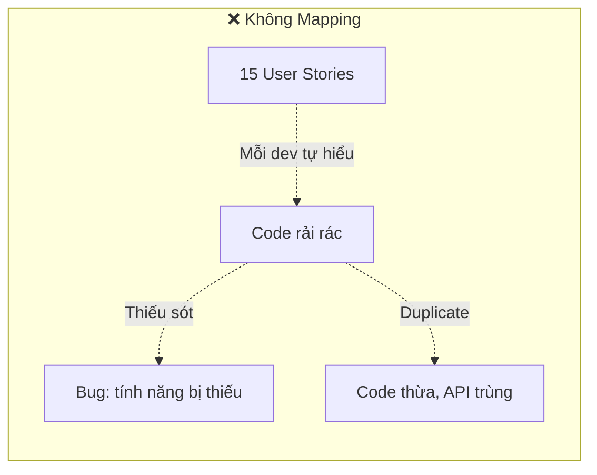
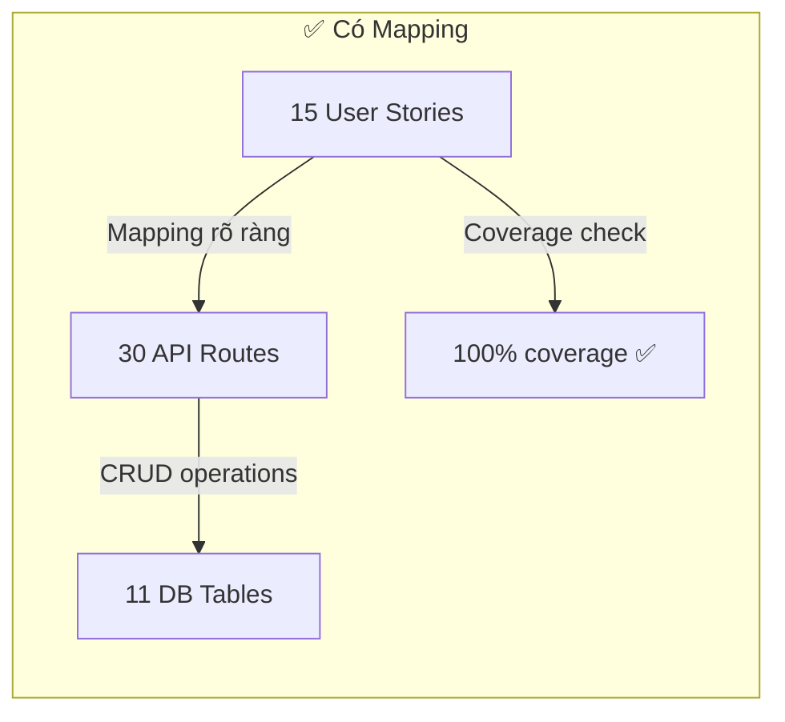
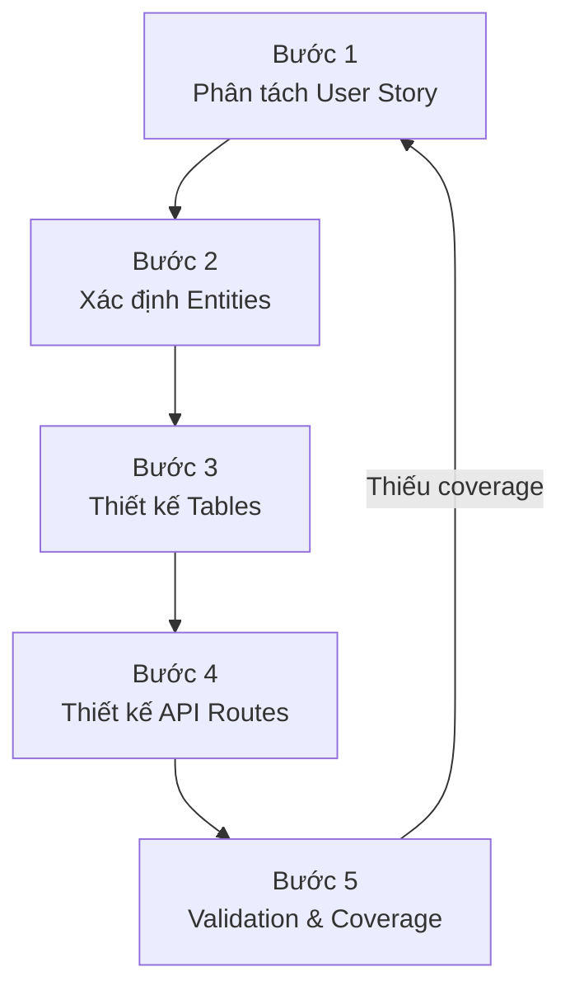
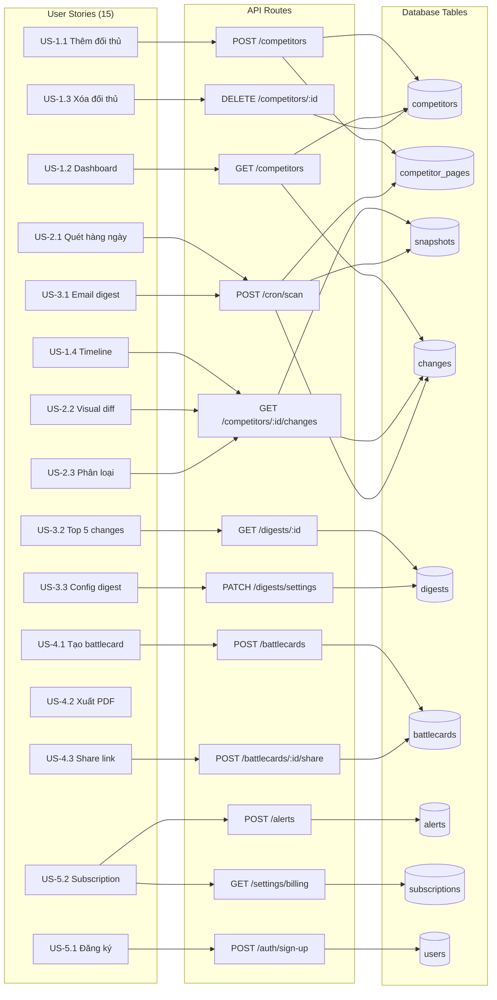

# CompeteRadar — Phase 4: Phương Pháp Luận Mapping User Story → API → Database

**Phiên bản**: 1.0  
**Ngày**: 2026-03-11  
**Mục đích**: Tài liệu sư phạm hướng dẫn nhân sự mới nắm vững phương pháp chuyển User Story thành thiết kế API và Database  
**Cấp độ kiến thức**: Biết → Hiểu → Làm → Áp dụng (Bloom's Taxonomy)  
**Skills sử dụng**: *(Knowledge engineering — không dùng skill cụ thể)*

---

## Mục Lục

1. [Cấp 1: BIẾT — Các Khái Niệm Cơ Bản](#cấp-1-biết--các-khái-niệm-cơ-bản)
2. [Cấp 2: HIỂU — Tại Sao Phải Mapping](#cấp-2-hiểu--tại-sao-phải-mapping)
3. [Cấp 3: LÀM — Quy Trình 5 Bước](#cấp-3-làm--quy-trình-5-bước)
4. [Cấp 4: ÁP DỤNG — Case Study CompeteRadar](#cấp-4-áp-dụng--case-study-competeradar)
5. [Bài Tập Tự Kiểm Tra](#bài-tập-tự-kiểm-tra)

---

## Cấp 1: BIẾT — Các Khái Niệm Cơ Bản

> 🎯 **Mục tiêu**: Sau phần này, bạn có thể **định nghĩa** và **nhận diện** được 3 thành phần cơ bản.

### 1.1 User Story là gì?

User Story là câu mô tả tính năng **từ góc nhìn người dùng**, theo format:

```
Là [vai trò], tôi có thể [hành động] để [mục đích/lợi ích]
```

**Ví dụ từ CompeteRadar:**
> US-1.1: Là founder, tôi có thể **thêm đối thủ bằng cách dán URL** để theo dõi họ tự động.

**Cấu trúc **:

| Thành phần | Ý nghĩa | Ví dụ |
|-----------|----------|-------|
| **Vai trò** (Actor) | Ai thực hiện hành động | Founder |
| **Hành động** (Action) | Người dùng muốn làm gì | Thêm đối thủ bằng URL |
| **Mục đích** (Benefit) | Tại sao cần tính năng này | Theo dõi tự động |

### 1.2 API Route là gì?

API (Application Programming Interface) Route là **cổng giao tiếp** giữa giao diện người dùng (frontend) và logic xử lý (backend).

```
[HTTP Method]  [URL Path]  →  [Xử lý]  →  [Response]
POST           /api/v1/competitors  →  Tạo đối thủ mới  →  201 Created
```

| Thành phần | Vai trò | Tương tự |
|-----------|---------|----------|
| **HTTP Method** | Loại hành động | GET=đọc, POST=tạo, PATCH=sửa, DELETE=xóa |
| **URL Path** | Địa chỉ resource | Tên bảng/đối tượng cần thao tác |
| **Request Body** | Dữ liệu gửi lên | Nội dung đơn đặt hàng |
| **Response** | Kết quả trả về | Xác nhận + dữ liệu mới |

### 1.3 Database Table là gì?

Database Table (bảng cơ sở dữ liệu) là nơi **lưu trữ dữ liệu** vĩnh viễn.

```
Bảng competitors:
┌──────┬──────────┬──────────────────────┬──────┐
│ id   │ user_id  │ url                  │ name │
├──────┼──────────┼──────────────────────┼──────┤
│ uuid │ uuid     │ https://rival.com    │ Rival│
│ uuid │ uuid     │ https://acme.com     │ ACME │
└──────┴──────────┴──────────────────────┴──────┘
```

| Thuật ngữ | Ý nghĩa |
|-----------|---------|
| **Table** | Một bảng = một loại đối tượng (competitors, digests...) |
| **Column** | Cột = thuộc tính của đối tượng (name, url, status...) |
| **Row** | Dòng = một bản ghi cụ thể |
| **Primary Key (PK)** | Giá trị duy nhất định danh mỗi dòng (id) |
| **Foreign Key (FK)** | Liên kết đến dòng trong bảng khác (user_id → users.id) |

### 1.4 Tam giác Mapping

```
         User Story
        (Người dùng muốn gì?)
              │
    ┌─────────┴──────────┐
    ▼                    ▼
 API Route           Database
(Xử lý như thế nào?) (Lưu ở đâu?)
```

> **Quy tắc vàng**: Mỗi User Story phải được cover bởi ít nhất 1 API Route, và mỗi API Route phải ghi/đọc từ ít nhất 1 Database Table. Nếu bất kỳ mũi tên nào bị đứt → có bug tiềm ẩn hoặc thiếu sót.

---

## Cấp 2: HIỂU — Tại Sao Phải Mapping

> 🎯 **Mục tiêu**: Sau phần này, bạn có thể **giải thích** lý do và **so sánh** hệ quả khi có/không mapping.

### 2.1 Vấn đề khi KHÔNG mapping



| Hệ quả | Mô tả | Ví dụ thực tế |
|---------|-------|---------------|
| **Thiếu tính năng** | Dev quên implement user story | Không có endpoint xóa đối thủ |
| **API thừa** | Tạo endpoint không ai dùng | Endpoint `/api/competitors/search` không có user story nào cần |
| **Bảng sai** | Thiết kế database không phù hợp | Lưu digest trong bảng competitors thay vì bảng riêng |
| **Onboard chậm** | Nhân sự mới mất 2-3 tuần hiểu hệ thống | Không biết endpoint nào phục vụ tính năng nào |

### 2.2 Lợi ích khi mapping



| Lợi ích | Tác động |
|---------|---------|
| **Traceability** | Từ bug → biết user story nào bị ảnh hưởng |
| **Completeness** | 100% user stories có API + DB |
| **Onboarding** | Nhân sự mới hiểu hệ thống trong 1-2 ngày |
| **Scope control** | Dễ phát hiện feature creep (tính năng vượt phạm vi) |
| **Testing** | Mỗi user story = 1 test case rõ ràng |

### 2.3 Mối quan hệ giữa 3 tầng

```
User Story    →    API Route    →    Database Table
  (What)           (How)              (Where)
  ────────         ────────           ────────
  Hành vi          Xử lý logic       Lưu trữ dữ liệu
  Ngôn ngữ         Ngôn ngữ          Ngôn ngữ
  người dùng       lập trình viên    database
```

**Quy tắc quan hệ:**

| Quan hệ | Giải thích | Ví dụ |
|---------|-----------|-------|
| 1 US → 1 API | Đơn giản nhất | US-1.3 "Xóa đối thủ" → `DELETE /competitors/:id` |
| 1 US → N API | Story phức tạp | US-1.1 "Thêm đối thủ" → `POST /competitors` + auto-detect logic |
| N US → 1 API | API đa năng | `GET /competitors` phục vụ cả US-1.2 (dashboard) |
| 1 API → N Table | Đọc/ghi nhiều bảng | `POST /competitors` → ghi `competitors` + `competitor_pages` |
| 1 Table → N API | Bảng được nhiều API dùng | `changes` dùng bởi `/changes`, `/digest`, `/alerts` |

---

## Cấp 3: LÀM — Quy Trình 5 Bước

> 🎯 **Mục tiêu**: Sau phần này, bạn có thể tự **thực hiện** mapping cho bất kỳ dự án nào.

### Quy trình tổng quan



---

### Bước 1: Phân Tách User Story → Hành Động CRUD

**Phương pháp**: Đọc user story, gạch chân **động từ** → chuyển thành CRUD.

| Động từ trong US | CRUD | HTTP Method |
|-----------------|------|-------------|
| Thêm, tạo, đăng ký | **C**reate | POST |
| Xem, danh sách, chi tiết | **R**ead | GET |
| Cập nhật, chỉnh sửa, cấu hình | **U**pdate | PATCH/PUT |
| Xóa, hủy | **D**elete | DELETE |
| Gửi, trigger, chia sẻ | **Action** | POST (custom) |

**Ví dụ thực hành:**

```
US-1.1: Là founder, tôi có thể [THÊM] đối thủ bằng cách [DÁN URL]

Phân tích:
├── Động từ: "thêm" → Create → POST
├── Đối tượng: "đối thủ" → Resource: competitors
├── Đầu vào: "dán URL" → Request body: { url: string }
└── Hành vi phụ: "auto-detect tên, logo" → Backend logic
```

### Bước 2: Xác Định Entities (Thực Thể)

**Phương pháp**: Từ tất cả user stories, liệt kê **danh từ** → nhóm thành entities.

```
Quét tất cả User Stories → Gạch chân danh từ:

US-1.1: ...thêm [đối thủ] bằng [URL]...
US-2.1: ...quét hàng ngày [website] [đối thủ]...
US-2.2: ...so sánh trực quan [thay đổi] [website]...
US-3.1: ...[email] hàng tuần tóm tắt [thay đổi] [đối thủ]...
US-4.1: ...tạo [battlecard] so sánh với [đối thủ]...
US-5.1: ...[đăng ký] bằng [email] hoặc [Google]...
US-5.2: ...quản lý [đăng ký] và [thanh toán]...
```

**Nhóm danh từ → Entities:**

| Danh từ gốc | Entity | Table name |
|-------------|--------|------------|
| đối thủ | Competitor | `competitors` |
| URL, website | Competitor Page | `competitor_pages` |
| ảnh chụp nội dung | Snapshot | `snapshots` |
| thay đổi | Change | `changes` |
| email tóm tắt | Digest | `digests` |
| battlecard | Battlecard | `battlecards` |
| cảnh báo | Alert | `alerts` |
| lịch sử cảnh báo | Alert Log | `alert_logs` |
| đăng ký, thanh toán | Subscription | `subscriptions` |
| API key (BYOK) | BYOK Key | `byok_keys` |
| người dùng | User | `users` (Better Auth) |

> **Mẹo**: Nếu 2 danh từ luôn đi kèm nhau (ví dụ "thay đổi website" và "thay đổi giá"), chúng có thể chung 1 bảng với cột phân loại (`change_type`).

### Bước 3: Thiết Kế Tables — Hỏi 4 Câu

Với mỗi entity, trả lời 4 câu:

| # | Câu hỏi | Kết quả | Ví dụ (competitors) |
|---|---------|---------|---------------------|
| 1 | **Thuộc về ai?** | Foreign Key | `user_id → users.id` |
| 2 | **Có những thuộc tính gì?** | Columns | `url, name, logo_url, status...` |
| 3 | **Liên kết với entity nào?** | FK relationships | competitors → competitor_pages (1:N) |
| 4 | **Cần tìm kiếm theo gì?** | Indexes | Index trên `(user_id, status)` |

**Template thiết kế 1 bảng:**

```
Entity: [Tên]
├── Thuộc về: [FK nào?]
├── Thuộc tính:
│   ├── id (PK, UUID)
│   ├── [FK columns]
│   ├── [Business columns]
│   ├── [Status/type enums]
│   └── created_at, updated_at
├── Liên kết:
│   ├── → [Bảng con] (1:N)
│   └── ← [Bảng cha] (N:1)
└── Indexes:
    ├── [Truy vấn cơ bản] → idx_[table]_[column]
    └── [Truy vấn phổ biến] → idx_[table]_[column1]_[column2]
```

**Ví dụ áp dụng:**

```
Entity: Competitor
├── Thuộc về: user_id → users.id
├── Thuộc tính:
│   ├── id (PK, UUID)
│   ├── user_id (FK)
│   ├── url, name, description, logo_url, industry
│   ├── status (enum: active|paused|error)
│   ├── last_scanned_at
│   └── created_at, updated_at
├── Liên kết:
│   ├── → competitor_pages (1:N)
│   ├── → battlecards (1:N)
│   └── ← users (N:1)
└── Indexes:
    ├── idx_competitors_user_id
    ├── idx_competitors_user_status
    └── UNIQUE(user_id, url)
```

### Bước 4: Thiết Kế API Routes — Công Thức

**Công thức đặt tên:**

```
[METHOD] /api/v1/[resource-plural]             → List / Create
[METHOD] /api/v1/[resource-plural]/:id         → Get / Update / Delete
[METHOD] /api/v1/[resource-plural]/:id/[action] → Custom action
[METHOD] /api/v1/[parent]/:id/[child]          → Nested resource
```

**Decision tree chọn HTTP Method:**

```
Người dùng muốn gì?
│
├── Đọc dữ liệu? → GET
│   ├── Danh sách? → GET /resources (cần pagination)
│   └── Chi tiết?  → GET /resources/:id
│
├── Tạo mới? → POST /resources
│   └── Body: dữ liệu cần tạo
│
├── Cập nhật? 
│   ├── Toàn bộ?  → PUT /resources/:id (hiếm dùng)
│   └── Một phần?  → PATCH /resources/:id (phổ biến)
│
├── Xóa? → DELETE /resources/:id
│
└── Hành động đặc biệt? → POST /resources/:id/[action]
    Ví dụ: scan, share, feedback
```

### Bước 5: Validation & Coverage Check

**Phương pháp kiểm tra coverage — Bảng Traceability:**

Tạo bảng 3 cột, mỗi dòng = 1 User Story:

```
| User Story | API Routes (≥ 1) | DB Tables (≥ 1) |
|-----------|------------------|-----------------|
| US-X.Y    | METHOD /path     | table_name      |

Quy tắc:
✅ Mỗi dòng phải có ≥ 1 API Route
✅ Mỗi dòng phải có ≥ 1 DB Table
❌ Dòng trống = thiếu coverage → quay lại Bước 1
```

**Checklist validation:**

- [ ] Mỗi User Story có ≥ 1 API route?
- [ ] Mỗi API route ghi/đọc ≥ 1 database table?
- [ ] Mỗi database table được ≥ 1 API route sử dụng? (nếu không → bảng thừa)
- [ ] Mỗi API route thuộc về ≥ 1 User Story? (nếu không → API thừa?)
- [ ] Relationships (FK) cover mọi liên kết giữa entities?
- [ ] Indexes cover mọi query pattern phổ biến?

---

## Cấp 4: ÁP DỤNG — Case Study CompeteRadar

> 🎯 **Mục tiêu**: Sau phần này, bạn có thể **phân tích** mapping thực tế và **phát hiện** lỗ hổng.

### Bảng Traceability đầy đủ — CompeteRadar

#### Epic 1: Quản lý Đối thủ

| User Story | Mô tả | API Route(s) | DB Table(s) | Ghi chú |
|-----------|-------|-------------|-------------|---------|
| **US-1.1** | Thêm đối thủ qua URL | `POST /api/v1/competitors` | `competitors`, `competitor_pages` | Auto-detect name, logo, description từ URL |
| **US-1.2** | Xem dashboard tổng quan | `GET /api/v1/competitors` | `competitors`, `changes` | Join lấy last change per competitor |
| **US-1.3** | Xóa đối thủ | `DELETE /api/v1/competitors/:id` | `competitors` | CASCADE xóa pages, snapshots, changes |
| **US-1.4** | Xem timeline thay đổi | `GET /api/v1/competitors/:id/changes` | `changes`, `snapshots` | Cursor-based pagination |

**Phân tích chi tiết — US-1.1:**

```
User Story: "Là founder, tôi có thể thêm đối thủ bằng cách dán URL"

Bước 1 — Phân tách:
├── Động từ: "thêm" → Create → POST
├── Đối tượng: "đối thủ" → competitors
├── Input: "dán URL" → { url: string }
└── Side effect: auto-detect → backend Puppeteer/Cheerio

Bước 2 — Entities liên quan:
├── competitors (chính)
└── competitor_pages (phụ — tạo default pages kèm theo)

Bước 3 — Column analysis:
├── Bắt buộc từ user: url
├── Auto-detect: name, description, logo_url
├── System-set: id, user_id, status='active', created_at
└── Optional: industry (user có thể bổ sung sau)

Bước 4 — API Design:
POST /api/v1/competitors
├── Request:  { url: "https://...", pages: ["homepage","pricing","blog"] }
├── Process:  validate URL → fetch page → extract meta → save
├── Response: 201 { data: { id, url, name, logo_url, pages: [...] } }
└── Errors:   422 (URL invalid), 409 (URL already tracked), 403 (limit reached)

Bước 5 — Validation:
✅ API Route: POST /api/v1/competitors
✅ DB Tables: competitors + competitor_pages
✅ Zod schema covers all input validation
✅ Error cases handled (invalid, duplicate, limit)
```

#### Epic 2: Phát hiện Thay đổi

| User Story | Mô tả | API Route(s) | DB Table(s) | Ghi chú |
|-----------|-------|-------------|-------------|---------|
| **US-2.1** | Quét hàng ngày | `POST /api/cron/scan` (Inngest) | `snapshots`, `competitor_pages` | Background job, không phải user-facing API |
| **US-2.2** | So sánh trực quan | `GET /api/v1/competitors/:id/changes` | `changes` (diff_data), `snapshots` (screenshot_url) | diff_data chứa old/new values |
| **US-2.3** | Phân loại thay đổi | Cùng endpoint trên | `changes` (change_type enum) | Enum: pricing, content, feature, brand, tech, social, other |

#### Epic 3: Tóm tắt AI

| User Story | Mô tả | API Route(s) | DB Table(s) | Ghi chú |
|-----------|-------|-------------|-------------|---------|
| **US-3.1** | Email digest hàng tuần | `POST /api/cron/digest` (Inngest) | `digests` | Gửi qua Resend |
| **US-3.2** | Top 5 thay đổi quan trọng | `GET /api/v1/digests/:id` | `digests` (changes_included JSONB) | AI ranking by severity |
| **US-3.3** | Cấu hình tần suất | `PATCH /api/v1/digests/settings` | `digests` (channel) | Frequency stored in user preferences |

#### Epic 4: Battlecard

| User Story | Mô tả | API Route(s) | DB Table(s) | Ghi chú |
|-----------|-------|-------------|-------------|---------|
| **US-4.1** | Tạo battlecard | `POST /api/v1/battlecards` | `battlecards` | AI streaming generation |
| **US-4.2** | Xuất PDF/PNG | Client-side (html2canvas) | `battlecards` (content) | Không cần API — render client |
| **US-4.3** | Chia sẻ link | `POST /api/v1/battlecards/:id/share` | `battlecards` (share_token, is_public) | Public route: `GET /api/v1/battlecards/shared/:token` |

#### Epic 5: Xác thực & Cài đặt

| User Story | Mô tả | API Route(s) | DB Table(s) | Ghi chú |
|-----------|-------|-------------|-------------|---------|
| **US-5.1** | Đăng ký | `POST /api/auth/sign-up`, `POST /api/auth/sign-in/social` | `users`, `accounts`, `sessions` | Better Auth managed |
| **US-5.2** | Quản lý subscription | `GET /api/v1/settings/billing`, `POST .../checkout`, `POST .../portal` | `subscriptions` | Stripe Checkout + Portal |
| **US-5.3** | Cấu hình thông báo | `POST /api/v1/alerts`, `PATCH /api/v1/settings/integrations` | `alerts` | Alert rules + Slack webhook |

### Coverage Summary

```
Tổng User Stories:  15
Covered by API:     15  ✅ (100%)
Covered by DB:      15  ✅ (100%)
Orphan APIs:         0  ✅ (0 API không có US)
Orphan Tables:       0  ✅ (0 bảng không có API)
```

### Mermaid — Full Mapping Visualization



---

## Bài Tập Tự Kiểm Tra

### Bài 1: Nhận diện (Cấp BIẾT)

Cho user story:
> "Là người dùng, tôi có thể **xem** lịch sử **cảnh báo** đã nhận"

**Câu hỏi:**
1. Động từ chính là gì? → CRUD nào?
2. Entity là gì? → Table name?
3. Phương thức HTTP nào?

<details>
<summary>Đáp án</summary>

1. "Xem" → Read → **GET**
2. "Cảnh báo đã nhận" → Alert Logs → **`alert_logs`**
3. **GET** `/api/v1/alerts/logs`
</details>

---

### Bài 2: Thiết kế (Cấp LÀM)

Giả sử CompeteRadar thêm tính năng mới:
> "Là founder, tôi có thể **gắn nhãn (tag)** cho đối thủ để **nhóm theo danh mục**"

**Yêu cầu:**
1. Xác định entities mới cần tạo
2. Thiết kế table (columns, FK, indexes)
3. Thiết kế API routes (CRUD)
4. Kiểm tra coverage

<details>
<summary>Đáp án tham khảo</summary>

**Entities:**
- `tags` — bảng lưu nhãn (name, color, user_id)
- `competitor_tags` — bảng trung gian liên kết (competitor_id, tag_id)

**Tables:**
```sql
CREATE TABLE tags (
    id UUID PRIMARY KEY DEFAULT uuid_generate_v4(),
    user_id UUID NOT NULL REFERENCES auth.users(id) ON DELETE CASCADE,
    name VARCHAR(50) NOT NULL,
    color VARCHAR(7) DEFAULT '#6B7280',
    created_at TIMESTAMPTZ DEFAULT NOW(),
    UNIQUE(user_id, name)
);

CREATE TABLE competitor_tags (
    competitor_id UUID REFERENCES competitors(id) ON DELETE CASCADE,
    tag_id UUID REFERENCES tags(id) ON DELETE CASCADE,
    PRIMARY KEY (competitor_id, tag_id)
);
```

**API Routes:**
```
GET    /api/v1/tags              — Danh sách tags
POST   /api/v1/tags              — Tạo tag mới
PATCH  /api/v1/tags/:id          — Sửa tag
DELETE /api/v1/tags/:id          — Xóa tag
POST   /api/v1/competitors/:id/tags   — Gắn tag cho đối thủ
DELETE /api/v1/competitors/:id/tags/:tagId — Gỡ tag
GET    /api/v1/competitors?tag=:tagId  — Filter theo tag
```

**Coverage:** ✅ US có API + DB
</details>

---

### Bài 3: Phân tích (Cấp ÁP DỤNG)

Xem lại bảng traceability ở trên. Tìm và trả lời:

1. Bảng nào được **nhiều API routes** sử dụng nhất? Tại sao?
2. User Story nào cần **nhiều API routes** nhất? Tại sao?
3. Nếu đổi database từ PostgreSQL sang MongoDB, table nào sẽ **khó chuyển nhất**? Tại sao?

<details>
<summary>Đáp án tham khảo</summary>

1. **`changes`** — được dùng bởi `/competitors/:id/changes`, `/cron/scan`, `/digests`. Lý do: changes là core data mà nhiều tính năng cần đọc (timeline, digest, alerts).

2. **US-5.2** "Quản lý subscription" — cần `GET /settings/billing` + `POST /checkout` + `POST /portal` + Stripe webhook. Lý do: payment flow phức tạp, liên quan bên thứ 3 (Stripe).

3. **`changes`** — khó nhất vì dùng `JSONB diff_data` (mạnh trong PostgreSQL), RLS policies phức tạp (subquery qua 3 bảng), và relationships FK chặt chẽ. MongoDB sẽ mất RLS + FK constraints.
</details>

---

## Tóm Tắt — 4 Cấp Độ

| Cấp | Bạn có thể | Dấu hiệu đạt |
|-----|-----------|--------------|
| 🟢 **Biết** | Định nghĩa User Story, API Route, DB Table | Giải thích từng khái niệm bằng lời riêng |
| 🔵 **Hiểu** | Giải thích tại sao mapping quan trọng | Chỉ ra hệ quả khi thiếu mapping |
| 🟡 **Làm** | Tự thực hiện 5 bước mapping | Hoàn thành bảng traceability cho 1 epic |
| 🔴 **Áp dụng** | Phân tích mapping phức tạp, phát hiện lỗ hổng | Thiết kế mapping cho tính năng mới, review mapping người khác |

---

*Phase 4 — Methodology v1.0 — Tài liệu sư phạm cho onboarding nhân sự mới*
