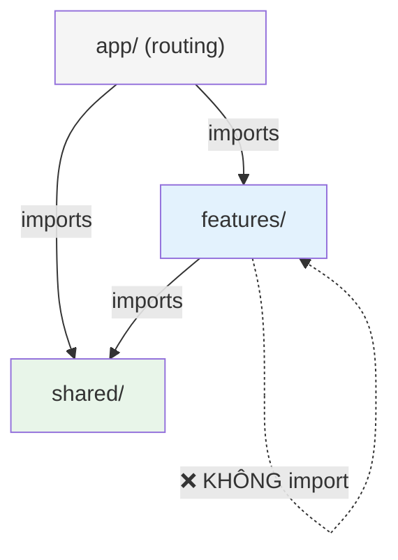

# CompeteRadar — Phase 4: Project Structure — Vertical Slice

**Phiên bản**: 1.0  
**Ngày**: 2026-03-11  
**Kiến trúc**: Vertical Slice / Feature-based  
**Tham chiếu**: Dùng chung tech stack, DB schema, API design từ `phase4-architecture.md`  
**Skills sử dụng**: `vercel-react-best-practices`, `vercel-composition-patterns`

---

## Triết Lý

Tổ chức code theo **nghiệp vụ/feature** (domain). Mỗi thư mục chứa **tất cả** cần thiết cho 1 tính năng:

```
Feature nào? → Folder nào → Chứa đầy đủ UI + API + DB + Types
──────────────────────────────────────────────────────────────
Competitors  → features/competitors/  → components/ + api/ + db/ + hooks/ + schemas
Digest       → features/digest/       → components/ + api/ + db/ + hooks/ + schemas
Battlecards  → features/battlecards/  → components/ + api/ + db/ + hooks/ + schemas
```

**Nguyên tắc cốt lõi:**
1. `app/` = routing only (thin layer, delegates xuống `features/`)
2. `features/` = business logic + UI per feature (vertical slices)
3. `shared/` = code dùng bởi ≥ 2 features (infra, UI primitives)

---

## Cấu Trúc Thư Mục

```
competeradar/
├── src/
│   ├── app/                              # 📄 THIN ROUTING LAYER
│   │   ├── (auth)/                       # Group: Auth pages
│   │   │   ├── login/page.tsx            # → imports from @/features/auth
│   │   │   ├── signup/page.tsx
│   │   │   └── layout.tsx
│   │   ├── (dashboard)/                  # Group: Authenticated pages
│   │   │   ├── dashboard/page.tsx        # → imports from @/features/dashboard
│   │   │   ├── competitors/
│   │   │   │   ├── page.tsx              # → imports from @/features/competitors
│   │   │   │   └── [id]/page.tsx
│   │   │   ├── digest/
│   │   │   │   ├── page.tsx              # → imports from @/features/digest
│   │   │   │   └── [id]/page.tsx
│   │   │   ├── battlecards/
│   │   │   │   ├── page.tsx              # → imports from @/features/battlecards
│   │   │   │   ├── new/page.tsx
│   │   │   │   └── [id]/page.tsx
│   │   │   ├── alerts/page.tsx
│   │   │   ├── settings/
│   │   │   │   ├── page.tsx              # → imports from @/features/settings
│   │   │   │   ├── ai/page.tsx
│   │   │   │   ├── billing/page.tsx      # → imports from @/features/billing
│   │   │   │   └── integrations/page.tsx
│   │   │   └── layout.tsx                # → imports from @/shared/layout
│   │   ├── b/[token]/page.tsx            # → imports from @/features/battlecards
│   │   ├── api/
│   │   │   ├── auth/[...all]/route.ts    # Better Auth catch-all
│   │   │   ├── v1/
│   │   │   │   ├── competitors/
│   │   │   │   │   ├── route.ts          # → delegates to @/features/competitors/api
│   │   │   │   │   └── [id]/
│   │   │   │   │       ├── route.ts
│   │   │   │   │       ├── scan/route.ts
│   │   │   │   │       ├── changes/route.ts
│   │   │   │   │       └── pages/route.ts
│   │   │   │   ├── digests/
│   │   │   │   │   ├── route.ts
│   │   │   │   │   ├── [id]/route.ts
│   │   │   │   │   ├── [id]/feedback/route.ts
│   │   │   │   │   └── settings/route.ts
│   │   │   │   ├── battlecards/
│   │   │   │   │   ├── route.ts
│   │   │   │   │   ├── [id]/route.ts
│   │   │   │   │   ├── [id]/share/route.ts
│   │   │   │   │   └── shared/[token]/route.ts
│   │   │   │   ├── alerts/
│   │   │   │   │   ├── route.ts
│   │   │   │   │   ├── [id]/route.ts
│   │   │   │   │   └── logs/route.ts
│   │   │   │   └── settings/
│   │   │   │       ├── ai/
│   │   │   │       │   ├── route.ts
│   │   │   │       │   └── byok/route.ts
│   │   │   │       ├── profile/route.ts
│   │   │   │       ├── billing/
│   │   │   │       │   ├── route.ts
│   │   │   │       │   ├── checkout/route.ts
│   │   │   │       │   └── portal/route.ts
│   │   │   │       └── integrations/route.ts
│   │   │   ├── cron/
│   │   │   │   ├── scan/route.ts         # → delegates to @/features/scanning/api
│   │   │   │   └── digest/route.ts       # → delegates to @/features/digest/api
│   │   │   └── webhooks/
│   │   │       └── stripe/route.ts       # → delegates to @/features/billing/api
│   │   ├── layout.tsx
│   │   └── page.tsx                      # Landing page
│   │
│   ├── features/                          # 🔹 VERTICAL SLICES
│   │   │
│   │   ├── competitors/                   # ── Feature: Quản lý đối thủ ──
│   │   │   ├── components/
│   │   │   │   ├── competitor-card.tsx     # Card hiển thị 1 đối thủ
│   │   │   │   ├── competitor-grid.tsx     # Grid/list đối thủ
│   │   │   │   ├── competitor-detail.tsx   # Trang chi tiết
│   │   │   │   ├── competitor-timeline.tsx # Timeline thay đổi (trên detail)
│   │   │   │   └── add-competitor-form.tsx # Form thêm đối thủ
│   │   │   ├── api/                       # API handler logic
│   │   │   │   ├── create-competitor.ts   # POST handler
│   │   │   │   ├── list-competitors.ts    # GET list handler
│   │   │   │   ├── get-competitor.ts      # GET detail handler
│   │   │   │   ├── update-competitor.ts   # PATCH handler
│   │   │   │   ├── delete-competitor.ts   # DELETE handler
│   │   │   │   └── trigger-scan.ts        # POST scan handler
│   │   │   ├── db/                        # DB queries (Drizzle)
│   │   │   │   ├── queries.ts             # SELECT queries
│   │   │   │   └── mutations.ts           # INSERT/UPDATE/DELETE
│   │   │   ├── hooks/
│   │   │   │   ├── use-competitors.ts     # List hook
│   │   │   │   └── use-competitor-detail.ts
│   │   │   ├── schemas.ts                 # Zod: CreateCompetitorSchema, etc.
│   │   │   ├── types.ts                   # Competitor, CompetitorPage types
│   │   │   └── index.ts                   # Barrel: export public API
│   │   │
│   │   ├── scanning/                      # ── Feature: Phát hiện thay đổi ──
│   │   │   ├── components/
│   │   │   │   ├── change-timeline.tsx     # Timeline thay đổi (standalone)
│   │   │   │   ├── diff-viewer.tsx         # Visual diff component
│   │   │   │   └── change-badge.tsx        # Badge severity
│   │   │   ├── api/
│   │   │   │   ├── get-changes.ts          # GET changes handler
│   │   │   │   └── cron-scan.ts            # Cron scan pipeline
│   │   │   ├── db/
│   │   │   │   ├── queries.ts
│   │   │   │   └── mutations.ts
│   │   │   ├── lib/                        # Domain-specific logic
│   │   │   │   ├── browser.ts              # Puppeteer manager
│   │   │   │   ├── extractor.ts            # Cheerio extraction
│   │   │   │   └── differ.ts               # Text diff engine
│   │   │   ├── schemas.ts
│   │   │   ├── types.ts                    # Snapshot, Change types
│   │   │   └── index.ts
│   │   │
│   │   ├── digest/                        # ── Feature: AI Weekly Summary ──
│   │   │   ├── components/
│   │   │   │   ├── digest-card.tsx
│   │   │   │   ├── digest-detail.tsx
│   │   │   │   ├── digest-settings.tsx
│   │   │   │   └── feedback-buttons.tsx
│   │   │   ├── api/
│   │   │   │   ├── list-digests.ts
│   │   │   │   ├── get-digest.ts
│   │   │   │   ├── submit-feedback.ts
│   │   │   │   ├── update-settings.ts
│   │   │   │   └── cron-digest.ts          # Cron digest pipeline
│   │   │   ├── db/
│   │   │   │   ├── queries.ts
│   │   │   │   └── mutations.ts
│   │   │   ├── lib/
│   │   │   │   └── generate-digest.ts      # AI digest generation logic
│   │   │   ├── hooks/
│   │   │   │   └── use-digests.ts
│   │   │   ├── schemas.ts
│   │   │   ├── types.ts
│   │   │   └── index.ts
│   │   │
│   │   ├── battlecards/                   # ── Feature: Battlecard ──
│   │   │   ├── components/
│   │   │   │   ├── battlecard-editor.tsx
│   │   │   │   ├── battlecard-preview.tsx
│   │   │   │   ├── battlecard-list.tsx
│   │   │   │   └── share-dialog.tsx
│   │   │   ├── api/
│   │   │   │   ├── create-battlecard.ts
│   │   │   │   ├── list-battlecards.ts
│   │   │   │   ├── update-battlecard.ts
│   │   │   │   ├── delete-battlecard.ts
│   │   │   │   ├── share-battlecard.ts
│   │   │   │   └── get-shared.ts           # Public shared view
│   │   │   ├── db/
│   │   │   │   ├── queries.ts
│   │   │   │   └── mutations.ts
│   │   │   ├── hooks/
│   │   │   │   └── use-battlecards.ts
│   │   │   ├── schemas.ts
│   │   │   ├── types.ts
│   │   │   └── index.ts
│   │   │
│   │   ├── alerts/                        # ── Feature: Cảnh báo ──
│   │   │   ├── components/
│   │   │   │   ├── alert-rule-form.tsx
│   │   │   │   ├── alert-rule-list.tsx
│   │   │   │   └── alert-log-list.tsx
│   │   │   ├── api/
│   │   │   │   ├── create-alert.ts
│   │   │   │   ├── list-alerts.ts
│   │   │   │   ├── update-alert.ts
│   │   │   │   ├── delete-alert.ts
│   │   │   │   └── get-logs.ts
│   │   │   ├── db/
│   │   │   │   ├── queries.ts
│   │   │   │   └── mutations.ts
│   │   │   ├── hooks/
│   │   │   │   └── use-alerts.ts
│   │   │   ├── schemas.ts
│   │   │   ├── types.ts
│   │   │   └── index.ts
│   │   │
│   │   ├── settings/                      # ── Feature: Settings + BYOK ──
│   │   │   ├── components/
│   │   │   │   ├── profile-form.tsx
│   │   │   │   ├── byok-form.tsx
│   │   │   │   ├── ai-model-card.tsx
│   │   │   │   └── integration-config.tsx
│   │   │   ├── api/
│   │   │   │   ├── get-profile.ts
│   │   │   │   ├── update-profile.ts
│   │   │   │   ├── save-byok.ts
│   │   │   │   ├── test-byok.ts
│   │   │   │   ├── delete-byok.ts
│   │   │   │   └── update-integrations.ts
│   │   │   ├── db/
│   │   │   │   ├── queries.ts
│   │   │   │   └── mutations.ts
│   │   │   ├── hooks/
│   │   │   │   └── use-settings.ts
│   │   │   ├── schemas.ts
│   │   │   ├── types.ts
│   │   │   └── index.ts
│   │   │
│   │   ├── billing/                       # ── Feature: Stripe ──
│   │   │   ├── components/
│   │   │   │   ├── pricing-card.tsx
│   │   │   │   ├── plan-badge.tsx
│   │   │   │   └── billing-info.tsx
│   │   │   ├── api/
│   │   │   │   ├── get-subscription.ts
│   │   │   │   ├── create-checkout.ts
│   │   │   │   ├── create-portal.ts
│   │   │   │   └── handle-webhook.ts
│   │   │   ├── db/
│   │   │   │   ├── queries.ts
│   │   │   │   └── mutations.ts
│   │   │   ├── lib/
│   │   │   │   └── stripe-client.ts
│   │   │   ├── schemas.ts
│   │   │   ├── types.ts
│   │   │   └── index.ts
│   │   │
│   │   └── dashboard/                     # ── Feature: Dashboard ──
│   │       ├── components/
│   │       │   ├── dashboard-summary.tsx
│   │       │   ├── important-changes.tsx
│   │       │   └── recent-activity.tsx
│   │       ├── api/
│   │       │   └── get-dashboard-data.ts
│   │       ├── hooks/
│   │       │   └── use-dashboard.ts
│   │       ├── types.ts
│   │       └── index.ts
│   │
│   ├── shared/                            # 🔹 SHARED INFRASTRUCTURE
│   │   ├── ui/                            # Design system primitives
│   │   │   ├── button.tsx
│   │   │   ├── input.tsx
│   │   │   ├── card.tsx
│   │   │   ├── badge.tsx
│   │   │   ├── modal.tsx
│   │   │   ├── toast.tsx
│   │   │   ├── tabs.tsx
│   │   │   ├── skeleton.tsx
│   │   │   ├── empty-state.tsx
│   │   │   ├── dropdown.tsx
│   │   │   └── avatar.tsx
│   │   ├── layout/
│   │   │   ├── sidebar.tsx
│   │   │   ├── bottom-nav.tsx
│   │   │   ├── nav-item.tsx
│   │   │   └── page-header.tsx
│   │   ├── db/                            # Database foundation
│   │   │   ├── schema.ts                  # Drizzle schema (ALL tables)
│   │   │   ├── client.ts                  # Supabase + Drizzle client
│   │   │   └── migrations/               # SQL migrations
│   │   ├── auth/
│   │   │   ├── server.ts                  # Better Auth server
│   │   │   ├── client.ts                  # Better Auth client
│   │   │   └── middleware.ts              # Route protection
│   │   ├── ai/                            # LLM Gateway
│   │   │   ├── gateway.ts
│   │   │   └── prompts.ts
│   │   ├── email/
│   │   │   ├── client.ts                  # Resend config
│   │   │   └── templates/
│   │   │       ├── digest.tsx
│   │   │       ├── alert.tsx
│   │   │       └── welcome.tsx
│   │   ├── inngest/
│   │   │   ├── client.ts
│   │   │   └── functions.ts               # Registers feature cron functions
│   │   └── utils/
│   │       ├── crypto.ts                  # BYOK encryption
│   │       ├── rate-limit.ts
│   │       ├── pagination.ts
│   │       └── format.ts
│   │
│   └── styles/
│       └── globals.css
│
├── drizzle.config.ts
├── inngest.config.ts
├── next.config.ts
├── tailwind.config.ts
├── tsconfig.json
├── package.json
└── .env.local
```

---

## Path Aliases (tsconfig.json)

```json
{
  "compilerOptions": {
    "paths": {
      "@/*": ["./src/*"],
      "@/features/*": ["./src/features/*"],
      "@/shared/*": ["./src/shared/*"],
      "@/ui/*": ["./src/shared/ui/*"]
    }
  }
}
```

---

## Quy Tắc Import (Dependency Rules)



| Quy tắc | Cho phép | Ví dụ |
|---------|---------|-------|
| `app/` → `features/` | ✅ | `import { CompetitorGrid } from '@/features/competitors'` |
| `app/` → `shared/` | ✅ | `import { Sidebar } from '@/shared/layout/sidebar'` |
| `features/` → `shared/` | ✅ | `import { Button } from '@/ui/button'` |
| `features/` → `features/` | ❌ | **KHÔNG** import giữa features |
| `shared/` → `features/` | ❌ | **KHÔNG** import ngược lên |

> **Khi 2 features cần cùng logic**: chuyển logic vào `shared/`.

---

## Import Patterns

```typescript
// Page component (thin — chỉ routing + layout)
// src/app/(dashboard)/competitors/page.tsx
import { CompetitorGrid } from '@/features/competitors';
import { PageHeader } from '@/shared/layout/page-header';

export default function CompetitorsPage() {
  return (
    <>
      <PageHeader title="Đối thủ" />
      <CompetitorGrid />
    </>
  );
}

// API route (thin — chỉ delegate)
// src/app/api/v1/competitors/route.ts
import { listCompetitors } from '@/features/competitors/api/list-competitors';
import { createCompetitor } from '@/features/competitors/api/create-competitor';

export const GET = listCompetitors;
export const POST = createCompetitor;

// Feature API handler (has business logic)
// src/features/competitors/api/create-competitor.ts
import { db } from '@/shared/db/client';
import { competitors, competitorPages } from '@/shared/db/schema';
import { CreateCompetitorSchema } from '../schemas';
import type { NextRequest } from 'next/server';

export async function createCompetitor(req: NextRequest) {
  const body = CreateCompetitorSchema.parse(await req.json());
  // ... business logic here
}

// Feature barrel export
// src/features/competitors/index.ts
export { CompetitorGrid } from './components/competitor-grid';
export { CompetitorCard } from './components/competitor-card';
export { CompetitorDetail } from './components/competitor-detail';
export { AddCompetitorForm } from './components/add-competitor-form';
export { useCompetitors } from './hooks/use-competitors';
export { useCompetitorDetail } from './hooks/use-competitor-detail';
// Internal: api/, db/, schemas.ts — KHÔNG export
```

---

## Developer Workflow

**Kịch bản: Thêm trường `industry` vào Competitor**

```
Files cần sửa:
1. src/shared/db/schema.ts                              ← Thêm column (shared)
2. src/features/competitors/db/queries.ts               ← Update query
3. src/features/competitors/schemas.ts                  ← Update validation
4. src/features/competitors/types.ts                    ← Update type
5. src/features/competitors/components/competitor-detail.tsx ← Hiển thị UI
6. src/features/competitors/api/get-competitor.ts       ← API response

→ 6 files, nhưng 5/6 trong CÙNG 1 folder ✅
```

---

## Ưu / Nhược Điểm

### Ưu điểm
- ✅ **Co-location**: UI + Logic + Types nằm cạnh nhau
- ✅ **Feature isolation**: xóa 1 feature = xóa 1 folder
- ✅ **Low cognitive load**: làm feature X → mở folder X
- ✅ **Onboarding nhanh**: nhân sự mới chỉ cần hiểu 1 feature
- ✅ **AI agent friendly**: context tập trung, ít files cần mở
- ✅ **Scalable**: thêm feature = thêm folder, không phình folders cũ

### Nhược điểm
- ⚠️ **Cần kỷ luật**: phải tuân thủ import rules (dùng ESLint enforce)
- ⚠️ **Barrel exports overhead**: mỗi feature cần `index.ts`
- ⚠️ **`shared/` có thể phình**: nếu quá nhiều logic "shared" → horizontal disguised
- ⚠️ **Ít phổ biến**: một số dev chưa quen, tutorial ít dùng
- ⚠️ **DB schema tập trung**: `shared/db/schema.ts` vẫn là 1 file lớn

---

## File Count Breakdown

| Folder | Số files | Vai trò |
|--------|---------|---------|
| `app/` | ~35 | Routing + thin delegates |
| `features/` | ~70 | Business logic + UI per feature |
| `shared/` | ~25 | Infrastructure + UI primitives |
| **Tổng** | **~130** | (~35 files nhiều hơn horizontal do barrel exports + per-feature db/) |

---

## ESLint Rule (enforce import boundaries)

```javascript
// eslint.config.js — ngăn features import lẫn nhau
{
  rules: {
    'no-restricted-imports': ['error', {
      patterns: [
        {
          group: ['@/features/*/'],
          message: 'Features must not import from other features. Use @/shared/ instead.'
        }
      ]
    }]
  }
}
```

---

*Phase 4 — Vertical Slice Structure v1.0*
